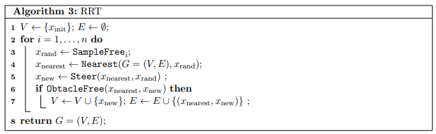
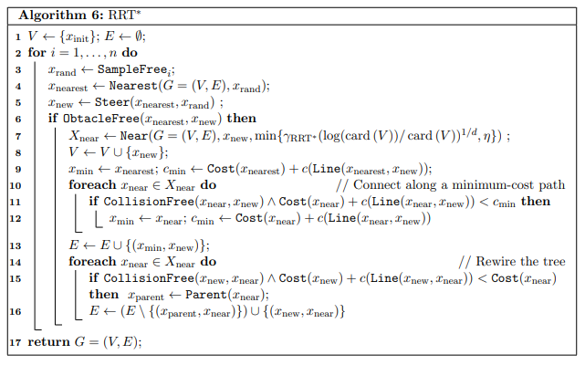

# Motion Planning using RRT and RRT*

## I. Overview :

The goal of this lab project was to explore Sampling based algorithms: RRT and its variants. Through this project, we implemented a binary occupancy grid (0 for free, 1 for occupied), and processed the Hokuyu 2D Lidar scans at a refresh rate of 25ms.

### RRT Pseudocode

The pseudocode of the basic version of RRT that we used is listed as above. As for RRT*, we used the pseudocode mentioned below.

### F1TENTH RRT vs. Generic RRT

In general, RRT is often used as a global planner where the tree is kept throughout the time steps. Whenever there is a new obstacle, and the occupancy grid changes, the tree will change accordingly. In our case, RRT is used as a local planner for obstacle avoidance. This is due to the fact that we don't have a well-defined starting point and goal point when we're racing on a track and we want to run continuous laps. In our implementation, we are only keeping a tree for the current time step in an area around the car. As speed is of the utmost importance (one update of laserscan every 25 ms), farster the process of finding nodes, and traversing the tree, faster is the implementation.

## IV. RRT vs. RRT* 
A comparison of the output we obtained from RRT and RRT* algorithm that we implemented is shown below.

 

Videos-
[RRT](https://www.youtube.com/watch?v=llHCRqwIllM) 

[RRT*](https://www.youtube.com/watch?v=llHCRqwIllM)

## References:
https://arxiv.org/pdf/1105.1186.pdf

